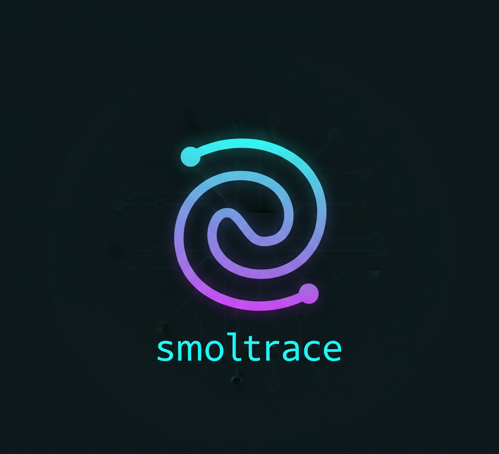

<div align="center">
  

  <h3><em>Tiny Agents. Total Visibility.</em></h3>
  <h3><em>Smol Agents. Smart Metrics.</em></h3>
</div>

# smoltrace

[](https://www.python.org/downloads/)
[](https://github.com/Mandark-droid/SMOLTRACE/blob/main/LICENSE)
[](https://badge.fury.io/py/smoltrace)
[](https://pepy.tech/project/smoltrace)
[](https://pepy.tech/project/smoltrace)
[](https://github.com/psf/black)
[](https://pycqa.github.io/isort/)
[](https://github.com/astral-sh/ruff)
[](https://github.com/Mandark-droid/SMOLTRACE/actions?query=workflow%3Atest)
[](https://huggingface.co/docs/smoltrace/en/index)

**SMOLTRACE** is a comprehensive benchmarking and evaluation framework for [Smolagents](https://huggingface.co/docs/smolagents), Hugging Face's lightweight agent library. It enables seamless testing of `ToolCallingAgent` and `CodeAgent` on custom or HF-hosted task datasets, with built-in support for OpenTelemetry (OTEL) tracing/metrics, results export to Hugging Face Datasets, and automated leaderboard updates.

Designed for reproducibility and scalability, it integrates with HF Spaces, Jobs, and the Datasets library. Evaluate your fine-tuned models, compare agent types, and contribute to community leaderboards—all in a few lines of code.

## Features

- **Zero Configuration**: Only HF_TOKEN required - automatically generates dataset names from username
- **Task Loading**: Pull evaluation tasks from HF Datasets (e.g., `smolagents/tasks`) or local JSON
- **Agent Benchmarking**: Run Tool and Code agents on categorized tasks (easy/medium/hard) with tool usage verification
- **Multi-Provider Support**:
  - **LiteLLM** (default): API models from OpenAI, Anthropic, Mistral, Groq, Together AI, etc.
  - **Transformers**: Local HuggingFace models on GPU
  - **Ollama**: Local models via Ollama server
- **OTEL Integration**: Auto-instrument with [genai-otel-instrument](https://github.com/Mandark-droid/genai_otel_instrument) for traces (spans, token counts) and metrics (CO2 emissions, power cost, GPU utilization)
- **Comprehensive Metrics**: All 7 GPU metrics tracked and aggregated in results/leaderboard:
  - Environmental: CO2 emissions (gCO2e), power cost (USD)
  - Performance: GPU utilization (%), memory usage (MiB), temperature (°C), power (W)
  - Flattened time-series format perfect for dashboards and visualization
- **Flexible Output**:
  - Push to HuggingFace Hub (4 separate datasets: results, traces, metrics, leaderboard)
  - Save locally as JSON files (5 files: results, traces, metrics, leaderboard row, metadata)
- **Dataset Cleanup**: Built-in `smoltrace-cleanup` utility to manage datasets with safety features (dry-run, confirmations, filters)
- **Leaderboard**: Aggregate metrics (success rate, tokens, CO2, cost) and auto-update shared org leaderboard
- **CLI & HF Jobs**: Run standalone or in containerized HF environments

## Installation

### Option 1: Install from source (recommended for development)

1.  **Clone the repository**:
    ```bash
    git clone https://github.com/Mandark-droid/SMOLTRACE.git
    cd SMOLTRACE
    ```

2.  **Create and activate a virtual environment**:
    ```bash
    python -m venv .venv
    source .venv/bin/activate  # On Windows use `.venv\Scripts\activate`
    ```

3.  **Install in editable mode**:
    ```bash
    pip install -e .
    ```

### Option 2: Install from PyPI (when available)

```bash
pip install smoltrace
```

### Optional Dependencies

For GPU metrics collection (when using local models with `--provider=transformers` or `--provider=ollama`):

```bash
pip install smoltrace[gpu]
```

**Note:** GPU metrics are **enabled by default** for local models (`transformers`, `ollama`). Use `--disable-gpu-metrics` to opt-out if desired.

**Requirements**:
- Python 3.10+
- Smolagents >=1.0.0
- Datasets, HuggingFace Hub
- OpenTelemetry SDK (auto-installed)
- genai-otel-instrument (auto-installed)
- duckduckgo-search (auto-installed)

## Quickstart

### 1. Setup Environment

Create a `.env` file (or export variables):

```bash
# Required
HF_TOKEN=hf_YOUR_HUGGINGFACE_TOKEN

# At least one API key (for --provider=litellm)
MISTRAL_API_KEY=YOUR_MISTRAL_API_KEY
# OR
OPENAI_API_KEY=sk-YOUR_OPENAI_API_KEY
# OR other providers (see .env.example)
```

### 2. Run Your First Evaluation

**Option A: Push to HuggingFace Hub (default)**

```bash
smoltrace-eval \
  --model mistral/mistral-small-latest \
  --provider litellm \
  --agent-type both \
  --enable-otel
```

This automatically:
- Loads tasks from default dataset
- Evaluates both tool and code agents
- Collects OTEL traces and metrics
- Creates 4 datasets: `{username}/smoltrace-results-{timestamp}`, `{username}/smoltrace-traces-{timestamp}`, `{username}/smoltrace-metrics-{timestamp}`, `{username}/smoltrace-leaderboard`
- Pushes everything to HuggingFace Hub

**Option B: Save Locally as JSON**

```bash
smoltrace-eval \
  --model mistral/mistral-small-latest \
  --provider litellm \
  --agent-type both \
  --enable-otel \
  --output-format json \
  --output-dir ./my_results
```

This creates a timestamped directory with 5 JSON files:
- `results.json` - Test case results
- `traces.json` - OpenTelemetry traces
- `metrics.json` - Aggregated metrics
- `leaderboard_row.json` - Leaderboard entry
- `metadata.json` - Run metadata

### 3. Try Different Providers

**LiteLLM (API models)**
```bash
smoltrace-eval \
  --model openai/gpt-4 \
  --provider litellm \
  --agent-type tool
```

**Transformers (GPU models)**
```bash
smoltrace-eval \
  --model meta-llama/Llama-3.1-8B \
  --provider transformers \
  --agent-type both
```

**Ollama (local models)**
```bash
# Ensure Ollama is running: ollama serve
smoltrace-eval \
  --model mistral \
  --provider ollama \
  --agent-type tool
```

## Usage

### CLI Arguments

| Flag | Description | Default | Choices |
|------|-------------|---------|---------|
| `--model` | Model ID (e.g., `mistral/mistral-small-latest`, `openai/gpt-4`) | **Required** | - |
| `--provider` | Model provider | `litellm` | `litellm`, `transformers`, `ollama` |
| `--hf-token` | HuggingFace token (or use `HF_TOKEN` env var) | From env | - |
| `--agent-type` | Agent type to evaluate | `both` | `tool`, `code`, `both` |
| `--difficulty` | Filter tasks by difficulty | All tasks | `easy`, `medium`, `hard` |
| `--dataset-name` | HF dataset for tasks | `kshitijthakkar/smoalagent-tasks` | Any HF dataset |
| `--split` | Dataset split to use | `train` | - |
| `--enable-otel` | Enable OpenTelemetry tracing/metrics | `False` | - |
| `--run-id` | Unique run identifier (UUID format) | Auto-generated | Any string |
| `--output-format` | Output destination | `hub` | `hub`, `json` |
| `--output-dir` | Directory for JSON output (when `--output-format=json`) | `./smoltrace_results` | - |
| `--private` | Make HuggingFace datasets private | `False` | - |
| `--prompt-yml` | Path to custom prompt configuration YAML | None | - |
| `--mcp-server-url` | MCP server URL for MCP tools | None | - |
| `--additional-imports` | Additional Python modules for CodeAgent (space-separated) | None | - |
| `--quiet` | Reduce output verbosity | `False` | - |
| `--debug` | Enable debug output | `False` | - |

**Note**: Dataset names (`results`, `traces`, `metrics`, `leaderboard`) are **automatically generated** from your HF username and timestamp. No need to specify repository names!

### Advanced Usage Examples

**1. MCP Tools Integration**

Run evaluations with external tools via MCP server:

```bash
# Start your MCP server (e.g., http://localhost:8000/sse)
# Then run evaluation with MCP tools
smoltrace-eval \
  --model openai/gpt-4 \
  --provider litellm \
  --agent-type code \
  --mcp-server-url http://localhost:8000/sse \
  --enable-otel
```

**2. Custom Prompt Templates**

Use custom prompt configurations from YAML files:

```bash
# Use one of the built-in templates
smoltrace-eval \
  --model openai/gpt-4 \
  --provider litellm \
  --agent-type code \
  --prompt-yml smoltrace/prompts/code_agent.yaml \
  --enable-otel

# Or use your own custom prompt
smoltrace-eval \
  --model openai/gpt-4 \
  --provider litellm \
  --agent-type code \
  --prompt-yml path/to/my_custom_prompt.yaml \
  --enable-otel
```

Built-in prompt templates available in `smoltrace/prompts/`:
- `code_agent.yaml` - Standard code agent prompts
- `structured_code_agent.yaml` - Structured JSON output format
- `toolcalling_agent.yaml` - Tool calling agent prompts

**3. Additional Python Imports for CodeAgent**

Allow CodeAgent to use additional Python modules:

```bash
# Allow pandas, numpy, and matplotlib imports
smoltrace-eval \
  --model openai/gpt-4 \
  --provider litellm \
  --agent-type code \
  --additional-imports pandas numpy matplotlib \
  --enable-otel

# Combine with MCP tools and custom prompts
smoltrace-eval \
  --model openai/gpt-4 \
  --provider litellm \
  --agent-type code \
  --prompt-yml smoltrace/prompts/code_agent.yaml \
  --mcp-server-url http://localhost:8000/sse \
  --additional-imports pandas numpy json yaml plotly \
  --enable-otel
```

**Note**: Make sure the specified modules are installed in your environment.

### Python API

```python
from smoltrace.core import run_evaluation
import os

# Simple usage - everything is auto-configured!
all_results, trace_data, metric_data, dataset_used, run_id = run_evaluation(
    model="openai/gpt-4",
    provider="litellm",
    agent_type="both",
    difficulty="easy",
    enable_otel=True,
    enable_gpu_metrics=False,  # False for API models (default), True for local models
    hf_token=os.getenv("HF_TOKEN")
)

# Results are automatically pushed to HuggingFace Hub as:
# - {username}/smoltrace-results-{timestamp}
# - {username}/smoltrace-traces-{timestamp}
# - {username}/smoltrace-metrics-{timestamp}
# - {username}/smoltrace-leaderboard (updated)

print(f"Evaluation complete! Run ID: {run_id}")
print(f"Total tests: {len(all_results.get('tool', []) + all_results.get('code', []))}")
print(f"Traces collected: {len(trace_data)}")
```

**Advanced: Using MCP Tools, Custom Prompts, and Additional Imports**

```python
from smoltrace.core import run_evaluation
from smoltrace.utils import load_prompt_config
import os

# Load custom prompt configuration
prompt_config = load_prompt_config("smoltrace/prompts/code_agent.yaml")

# Run evaluation with all advanced features
all_results, trace_data, metric_data, dataset_used, run_id = run_evaluation(
    model_name="openai/gpt-4",
    agent_types=["code"],  # CodeAgent only
    test_subset="medium",
    dataset_name="kshitijthakkar/smoalagent-tasks",
    split="train",
    enable_otel=True,
    verbose=True,
    debug=False,
    provider="litellm",
    prompt_config=prompt_config,  # Custom prompt template
    mcp_server_url="http://localhost:8000/sse",  # MCP tools
    additional_authorized_imports=["pandas", "numpy", "matplotlib", "json"],  # Extra imports
    enable_gpu_metrics=False,
)

print(f"✅ Evaluation complete!")
print(f"   Run ID: {run_id}")
print(f"   MCP tools were loaded from the server")
print(f"   CodeAgent can use: pandas, numpy, matplotlib, json")
print(f"   Custom prompts applied from YAML")
```

**Advanced: Manual dataset management**

```python
from smoltrace.core import run_evaluation
from smoltrace.utils import (
    get_hf_user_info,
    generate_dataset_names,
    push_results_to_hf,
    compute_leaderboard_row,
    update_leaderboard
)
import os

# Get HF token
hf_token = os.getenv("HF_TOKEN")

# Get username from token
user_info = get_hf_user_info(hf_token)
username = user_info["username"]

# Generate dataset names
results_repo, traces_repo, metrics_repo, leaderboard_repo = generate_dataset_names(username)

print(f"Will create datasets:")
print(f"  Results: {results_repo}")
print(f"  Traces: {traces_repo}")
print(f"  Metrics: {metrics_repo}")
print(f"  Leaderboard: {leaderboard_repo}")

# Run evaluation
all_results, trace_data, metric_data, dataset_used, run_id = run_evaluation(
    model="meta-llama/Llama-3.1-8B",
    provider="transformers",
    agent_type="both",
    enable_otel=True,
    enable_gpu_metrics=True,  # Auto-enabled for local models (default)
    hf_token=hf_token
)

# Push to HuggingFace Hub
push_results_to_hf(
    all_results=all_results,
    trace_data=trace_data,
    metric_data=metric_data,
    results_repo=results_repo,
    traces_repo=traces_repo,
    metrics_repo=metrics_repo,
    model_name="meta-llama/Llama-3.1-8B",
    hf_token=hf_token,
    private=False,
    run_id=run_id
)

# Compute leaderboard row
leaderboard_row = compute_leaderboard_row(
    model_name="meta-llama/Llama-3.1-8B",
    all_results=all_results,
    trace_data=trace_data,
    metric_data=metric_data,
    dataset_used=dataset_used,
    results_dataset=results_repo,
    traces_dataset=traces_repo,
    metrics_dataset=metrics_repo,
    agent_type="both",
    run_id=run_id,
    provider="transformers"
)

# Update leaderboard
update_leaderboard(leaderboard_repo, leaderboard_row, hf_token)

print("✅ Evaluation complete and pushed to HuggingFace Hub!")
```

### Custom Tasks

Create a JSON dataset with tasks:

```json
[
  {
    "id": "custom-tool-test",
    "prompt": "What's the weather in Tokyo?",
    "expected_tool": "get_weather",
    "difficulty": "easy",
    "agent_type": "tool",
    "expected_keywords": ["18°C", "Clear"]
  }
]
```

Push to HF: `Dataset.from_list(tasks).push_to_hub("your-username/custom-tasks")`

Load in eval: `--dataset-name your-username/custom-tasks`.

## Examples

### Basic Tool Agent Eval

```bash
smoltrace-eval \
  --model mistral/mistral-small-latest \
  --provider litellm \
  --agent-type tool \
  --difficulty easy \
  --enable-otel
```

**Output** (console summary):
```
TOOL AGENT SUMMARY
Total: 5, Success: 4/5 (80.0%)
Tool called: 100%, Correct tool: 80%, Avg steps: 2.6

[SUCCESS] Evaluation complete! Results pushed to HuggingFace Hub.
  Results: https://huggingface.co/datasets/{username}/smoltrace-results-20250125_143000
  Traces: https://huggingface.co/datasets/{username}/smoltrace-traces-20250125_143000
  Metrics: https://huggingface.co/datasets/{username}/smoltrace-metrics-20250125_143000
  Leaderboard: https://huggingface.co/datasets/{username}/smoltrace-leaderboard
```

### OTEL-Enabled Run with GPU Model

```bash
smoltrace-eval \
  --model meta-llama/Llama-3.1-8B \
  --provider transformers \
  --agent-type both \
  --enable-otel
```

**Automatically collects:**
- ✅ OpenTelemetry traces with span details
- ✅ Token usage (prompt, completion, total)
- ✅ Cost tracking
- ✅ GPU metrics (utilization, memory, temperature, power)
- ✅ CO2 emissions

**Automatically creates 4 datasets:**
- Results: Test case outcomes
- Traces: OpenTelemetry span data
- Metrics: GPU metrics and aggregates
- Leaderboard: Aggregate statistics (success rate, tokens, CO2, cost)

### HuggingFace Jobs Integration

Run SMOLTRACE evaluations on HuggingFace's cloud infrastructure with pay-as-you-go billing. Perfect for large-scale evaluations without local GPU requirements.

**Prerequisites:**
- HuggingFace Pro account or Team/Enterprise organization
- `huggingface_hub` Python package: `pip install huggingface_hub`

#### Option 1: CLI (Quick Start)

**Working CPU Example (API models):**
```bash
hf jobs run \
  --flavor cpu-basic \
  -s HF_TOKEN=hf_your_token \
  -s OPENAI_API_KEY=your_openai_api_key \
  python:3.12 \
  bash -c "pip install smoltrace ddgs && smoltrace-eval --model openai/gpt-4 --provider litellm --enable-otel"
```

**GPU Example (Local models):**
```bash
# Note: This triggers the job but may show fief-client warnings during installation
# The warnings don't prevent execution but the command may need refinement
hf jobs run \
  --flavor t4-small \
  -s HF_TOKEN=hf_your_token \
  pytorch/pytorch:2.6.0-cuda12.4-cudnn9-devel \
  bash -c "pip install smoltrace ddgs smoltrace[gpu] && smoltrace-eval --model Qwen/Qwen3-4B --provider transformers --enable-otel"
```

**Available Flavors:**
- **CPU**: `cpu-basic`, `cpu-upgrade`
- **GPU**: `t4-small`, `t4-medium`, `l4x1`, `l4x4`, `a10g-small`, `a10g-large`, `a10g-largex2`, `a10g-largex4`, `a100-large`
- **TPU**: `v5e-1x1`, `v5e-2x2`, `v5e-2x4`

#### Option 2: Python API (Programmatic)

```python
from huggingface_hub import run_job

# CPU job for API models (OpenAI, Anthropic, etc.)
job = run_job(
    image="python:3.12",
    command=[
        "bash", "-c",
        "pip install smoltrace ddgs && smoltrace-eval --model openai/gpt-4o-mini --provider litellm --agent-type both --enable-otel"
    ],
    secrets={
        "HF_TOKEN": "hf_your_token",
        "OPENAI_API_KEY": "your_openai_api_key"
    },
    flavor="cpu-basic",
    timeout="1h"
)

print(f"Job ID: {job.id}")
print(f"Job URL: {job.url}")

# GPU job for local models (Qwen, Llama, Mistral, etc.)
job = run_job(
    image="pytorch/pytorch:2.6.0-cuda12.4-cudnn9-devel",
    command=[
        "bash", "-c",
        "pip install smoltrace ddgs smoltrace[gpu] && smoltrace-eval --model Qwen/Qwen2-4B --provider transformers --agent-type both --enable-otel"
    ],
    secrets={
        "HF_TOKEN": "hf_your_token"
    },
    flavor="t4-small",  # Cost-effective GPU for small models
    timeout="2h"
)

print(f"Job ID: {job.id}")
```

#### Monitor Job Progress

```python
from huggingface_hub import inspect_job, fetch_job_logs

# Check job status
job_status = inspect_job(job_id=job.id)
print(f"Status: {job_status.status.stage}")  # PENDING, RUNNING, COMPLETED, ERROR

# Stream logs in real-time
for log in fetch_job_logs(job_id=job.id):
    print(log, end="")
```

#### Advanced: Scheduled Evaluations

Run evaluations on a schedule (e.g., nightly model comparisons):

```python
from huggingface_hub import create_scheduled_job

# Run every day at 2 AM
create_scheduled_job(
    image="python:3.12",
    command=[
        "pip", "install", "smoltrace", "&&",
        "smoltrace-eval",
        "--model", "openai/gpt-4",
        "--provider", "litellm",
        "--agent-type", "both",
        "--enable-otel"
    ],
    env={
        "HF_TOKEN": "hf_your_token",
        "OPENAI_API_KEY": "sk_your_key"
    },
    schedule="0 2 * * *",  # CRON syntax: 2 AM daily
    flavor="cpu-basic"
)

# Or use preset schedules
create_scheduled_job(..., schedule="@daily")  # Options: @hourly, @daily, @weekly, @monthly
```

**Results:** All datasets are automatically created under your HuggingFace account:
- `{username}/smoltrace-results-{timestamp}`
- `{username}/smoltrace-traces-{timestamp}`
- `{username}/smoltrace-metrics-{timestamp}`
- `{username}/smoltrace-leaderboard` (updated)

**Cost Optimization Tips:**
1. Use `cpu-basic` for API models (OpenAI, Anthropic) - no GPU needed
2. Use `a10g-small` for 7B-13B parameter models - cheapest GPU option
3. Set `timeout` to avoid runaway costs (e.g., `timeout="1h"`)
4. Use `--difficulty easy` for quick testing before full evaluation

**Note:** HuggingFace Jobs are available only to Pro users and Team/Enterprise organizations. Pay-as-you-go billing applies - you only pay for the seconds you use.

## Dataset Cleanup

**Important**: Each SMOLTRACE evaluation creates **3 new datasets** on HuggingFace Hub:
- `{username}/smoltrace-results-{timestamp}`
- `{username}/smoltrace-traces-{timestamp}`
- `{username}/smoltrace-metrics-{timestamp}`

After running multiple evaluations, this can clutter your HuggingFace profile. Use the `smoltrace-cleanup` utility to manage these datasets safely.

### Quick Start

```bash
# Preview what would be deleted (safe, no actual deletion)
smoltrace-cleanup --older-than 7d

# Delete datasets older than 30 days
smoltrace-cleanup --older-than 30d --no-dry-run

# Keep only 5 most recent evaluations
smoltrace-cleanup --keep-recent 5 --no-dry-run

# Delete incomplete runs (missing traces or metrics)
smoltrace-cleanup --incomplete-only --no-dry-run
```

### Cleanup Options

| Flag | Description | Example |
|------|-------------|---------|
| `--older-than DAYS` | Delete datasets older than N days | `--older-than 7d` |
| `--keep-recent N` | Keep only N most recent evaluations | `--keep-recent 5` |
| `--incomplete-only` | Delete only incomplete runs (missing datasets) | `--incomplete-only` |
| `--all` | Delete ALL SMOLTRACE datasets (⚠️ use with caution!) | `--all` |
| `--only TYPE` | Delete only specific dataset type | `--only results` |
| `--no-dry-run` | Actually delete (required for real deletion) | `--no-dry-run` |
| `--yes` | Skip confirmation prompts (for automation) | `--yes` |
| `--preserve-leaderboard` | Preserve leaderboard dataset (default: true) | `--preserve-leaderboard` |

### Safety Features

- **Dry-run by default**: Shows what would be deleted without actually deleting
- **Confirmation prompts**: Requires typing 'DELETE' to confirm deletion
- **Leaderboard protection**: Never deletes your leaderboard by default
- **Pattern matching**: Only deletes datasets matching exact SMOLTRACE naming patterns
- **Error handling**: Continues on errors and reports partial success

### CLI Examples

```bash
# 1. Preview deletion (safe, no actual deletion)
smoltrace-cleanup --older-than 7d
# Output: Shows 6 datasets (2 runs) that would be deleted

# 2. Delete datasets older than 30 days with confirmation
smoltrace-cleanup --older-than 30d --no-dry-run
# Prompts: Type 'DELETE' to confirm
# Output: Deletes matching datasets

# 3. Keep only 3 most recent evaluations (batch mode)
smoltrace-cleanup --keep-recent 3 --no-dry-run --yes
# No confirmation prompt, deletes immediately

# 4. Delete incomplete runs (missing traces or metrics)
smoltrace-cleanup --incomplete-only --no-dry-run

# 5. Delete only results datasets, keep traces and metrics
smoltrace-cleanup --only results --older-than 30d --no-dry-run

# 6. Get help
smoltrace-cleanup --help
```

### Python API

```python
from smoltrace import cleanup_datasets

# Preview deletion (dry-run)
result = cleanup_datasets(
    older_than_days=7,
    dry_run=True,
    hf_token="hf_..."
)
print(f"Would delete {result['total_deleted']} datasets from {result['total_scanned']} runs")

# Actual deletion with confirmation skip
result = cleanup_datasets(
    older_than_days=30,
    dry_run=False,
    confirm=False,  # Skip confirmation (use with caution!)
    hf_token="hf_..."
)
print(f"Deleted: {len(result['deleted'])}, Failed: {len(result['failed'])}")

# Keep only N most recent evaluations
result = cleanup_datasets(
    keep_recent=5,
    dry_run=False,
    hf_token="hf_..."
)

# Delete incomplete runs
result = cleanup_datasets(
    incomplete_only=True,
    dry_run=False,
    hf_token="hf_..."
)
```

### Example Output

```
======================================================================
  SMOLTRACE Dataset Cleanup (DRY-RUN)
======================================================================

User: kshitij

Scanning datasets...
[INFO] Discovered 6 results, 6 traces, 6 metrics datasets
[INFO] Grouped into 6 runs (6 complete, 0 incomplete)
[INFO] Filter: Older than 7 days (before 2025-01-18) → 2 to delete, 4 to keep

======================================================================
  Deletion Summary
======================================================================

Runs to delete: 2
Datasets to delete: 6
Runs to keep: 4
Leaderboard: Preserved ✓

Datasets to delete:
  1. kshitij/smoltrace-results-20250108_120000
  2. kshitij/smoltrace-traces-20250108_120000
  3. kshitij/smoltrace-metrics-20250108_120000
  4. kshitij/smoltrace-results-20250110_153000
  5. kshitij/smoltrace-traces-20250110_153000
  6. kshitij/smoltrace-metrics-20250110_153000

======================================================================
  This is a DRY-RUN. No datasets will be deleted.
======================================================================

To actually delete, run with: dry_run=False
```

### Best Practices

1. **Always preview first**: Run with default dry-run to see what would be deleted
2. **Use time-based filters**: Delete old datasets (e.g., `--older-than 30d`)
3. **Keep recent runs**: Maintain a rolling window (e.g., `--keep-recent 10`)
4. **Clean incomplete runs**: Remove failed evaluations with `--incomplete-only`
5. **Automate cleanup**: Add to cron/scheduled tasks with `--yes` flag
6. **Preserve leaderboard**: Never use `--delete-leaderboard` unless absolutely necessary

### Automation Example

Add to your CI/CD or cron job:

```bash
#!/bin/bash
# cleanup_old_datasets.sh

# Delete datasets older than 30 days, keep leaderboard
smoltrace-cleanup \
  --older-than 30d \
  --no-dry-run \
  --yes \
  --preserve-leaderboard

# Exit with error code if any deletions failed
exit $?
```

---

## API Reference

### Evaluation Functions

- **`run_evaluation(...)`**: Main evaluation function; returns `(results_dict, traces_list, metrics_dict, dataset_name, run_id)`.
  - Automatically handles dataset creation and HuggingFace Hub push
  - Parameters: `model`, `provider`, `agent_type`, `difficulty`, `enable_otel`, `enable_gpu_metrics`, `hf_token`, etc.

- **`run_evaluation_flow(args)`**: CLI wrapper for `run_evaluation()` that handles argument parsing

### Dataset Management Functions

- **`generate_dataset_names(username)`**: Auto-generates dataset names from username and timestamp
  - Returns: `(results_repo, traces_repo, metrics_repo, leaderboard_repo)`

- **`get_hf_user_info(token)`**: Fetches HuggingFace user info from token
  - Returns: `{"username": str, "type": str, ...}`

- **`push_results_to_hf(...)`**: Exports results, traces, and metrics to HuggingFace Hub
  - Creates 3 timestamped datasets automatically

- **`compute_leaderboard_row(...)`**: Aggregates metrics for leaderboard entry
  - Returns: Dict with success rate, tokens, CO2, GPU stats, duration, cost, etc.

- **`update_leaderboard(...)`**: Appends new row to leaderboard dataset

### Cleanup Functions

- **`cleanup_datasets(...)`**: Clean up old SMOLTRACE datasets from HuggingFace Hub
  - Parameters: `older_than_days`, `keep_recent`, `incomplete_only`, `dry_run`, etc.

- **`discover_smoltrace_datasets(...)`**: Discover all SMOLTRACE datasets for a user
  - Returns: Dict categorized by type (results, traces, metrics, leaderboard)

- **`group_datasets_by_run(...)`**: Group datasets by evaluation run (timestamp)
  - Returns: List of run dictionaries with completeness status

- **`filter_runs(...)`**: Filter runs by age, count, or completeness
  - Returns: Tuple of (runs_to_delete, runs_to_keep)

Full docs: [huggingface.co/docs/smoltrace](https://huggingface.co/docs/smoltrace).

## Leaderboard

View community rankings at [huggingface.co/datasets/huggingface/smolagents-leaderboard](https://huggingface.co/datasets/huggingface/smolagents-leaderboard). Top models by success rate:

| Model | Agent Type | Success Rate | Avg Steps | Avg Duration (ms) | Total Duration (ms) | Total Tokens | CO2 (g) | Total Cost (USD) |
|-------|------------|--------------|-----------|-------------------|---------------------|--------------|---------|------------------|
| mistral/mistral-large | both | 92.5% | 2.5 | 500.0 | 15000 | 15k | 0.22 | 0.005 |
| meta-llama/Llama-3.1-8B | tool | 88.0% | 2.1 | 450.0 | 12000 | 12k | 0.18 | 0.004 |

Contribute your runs!

## Contributing

We welcome contributions! See [CONTRIBUTING.md](https://github.com/Mandark-droid/SMOLTRACE/blob/main/CONTRIBUTING.md) for guidelines.

1. Fork the repo.
2. Install in dev mode: `pip install -e .[dev]`.
3. Run tests: `pytest`.
4. Submit PR to `main`.

## License

AGPL-3.0. See [LICENSE](https://github.com/Mandark-droid/SMOLTRACE/blob/main/LICENSE).

---

## Common Use Cases

### Test with Easy Tasks Only

```bash
smoltrace-eval \
  --model mistral/mistral-small-latest \
  --provider litellm \
  --difficulty easy \
  --output-format json
```

### Compare Tool vs Code Agents

```bash
# Tool agent only
smoltrace-eval --model openai/gpt-4 --provider litellm --agent-type tool

# Code agent only
smoltrace-eval --model openai/gpt-4 --provider litellm --agent-type code

# Compare results in respective output directories
```

### GPU Model Evaluation with Metrics

```bash
smoltrace-eval \
  --model meta-llama/Llama-3.1-8B \
  --provider transformers \
  --agent-type both \
  --enable-otel
```

### Private Results (Don't Share Publicly)

```bash
smoltrace-eval \
  --model your-model \
  --provider litellm \
  --output-format hub \
  --private
```

---

⭐ **Star this repo** to support Smolagents! Questions? [Open an issue](https://github.com/Mandark-droid/SMOLTRACE/issues).
